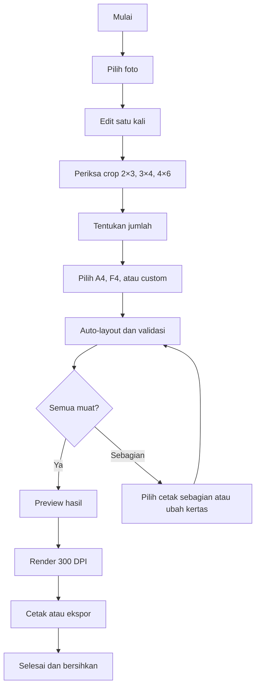
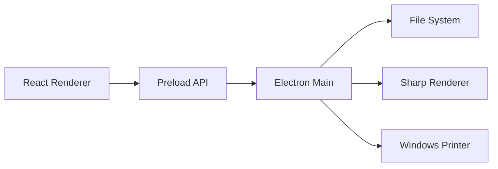

# PRODUCT REQUIREMENTS DOCUMENT (PRD)

# PRINTAMA DESKTOP

**Versi dokumen:** 1.0  
**Tanggal:** 30 Agustus 2026  
**Status:** Siap dijadikan acuan development MVP  
**Pemilik produk:** AdyatamaTECH  
**Platform:** Desktop Windows 10/11 64-bit  
**Model aplikasi:** Offline, tanpa akun, tanpa server, tanpa database bisnis

---

## 1. Ringkasan produk

Printama adalah aplikasi desktop Windows untuk mempercepat proses menyiapkan, menyusun, dan mencetak pas foto. Operator cukup memilih satu foto, melakukan koreksi dan crop satu kali, menentukan jumlah foto ukuran 2×3, 3×4, dan 4×6, lalu Printama menyusun semuanya secara otomatis pada kertas A4, F4, atau kertas potongan berukuran custom.

Nilai utama Printama:

> **Edit sekali, hasilkan berbagai ukuran, susun otomatis, dan hemat kertas.**

Printama tidak dirancang sebagai aplikasi kasir, penyimpanan pelanggan, cloud storage, atau manajemen pesanan. Seluruh foto diproses secara lokal, tidak diunggah, tidak dimasukkan ke database, dan tidak dimodifikasi pada lokasi asalnya.

---

## 2. Latar belakang masalah

Operator percetakan biasanya menghadapi pekerjaan berulang berikut:

1. Membuka foto pelanggan di aplikasi editor umum.
2. Mengoreksi foto dan membuat beberapa crop berbeda.
3. Mengubah ukuran menjadi 2×3, 3×4, dan 4×6 cm.
4. Menggandakan foto sesuai jumlah pesanan.
5. Menyusun foto satu per satu di kertas A4/F4.
6. Menghitung sendiri jumlah foto yang cukup dalam satu baris.
7. Mengatur ulang layout ketika memakai sisa kertas potongan.
8. Memastikan ukuran hasil cetak tidak berubah karena `Fit to Page`.

Proses tersebut memakan waktu, mudah salah ukuran, dan sering membuat area kertas terbuang. Aplikasi desain umum juga tidak berfokus pada satuan fisik, printable area printer, kapasitas per baris, dan pemanfaatan sisa kertas.

---

## 3. Tujuan produk

### 3.1 Tujuan utama

- Memungkinkan satu foto diedit satu kali dan langsung menghasilkan versi 2×3, 3×4, serta 4×6 cm.
- Membuat paket pas foto campuran dalam satu lembar secara otomatis.
- Mengoptimalkan penggunaan kertas A4, F4, dan ukuran custom.
- Mendukung pesanan penuh maupun hanya beberapa foto.
- Menjaga sisa kertas tetap berbentuk bidang besar agar bisa digunakan kembali.
- Menghasilkan JPG, PNG, atau PDF dengan ukuran fisik presisi dan resolusi 300 DPI.
- Mencetak menggunakan skala 100% tanpa perubahan ukuran fisik.

### 3.2 Sasaran keberhasilan MVP

- Operator dapat menyelesaikan satu paket foto standar dalam waktu maksimal dua menit setelah foto dipilih.
- Selisih ukuran hasil cetak maksimal ±0,5 mm setelah printer dikalibrasi.
- Sistem selalu memberi tahu apakah seluruh foto muat sebelum proses render/cetak.
- Tidak ada foto yang dikecilkan diam-diam agar masuk ke kertas.
- Semua fungsi inti tetap berjalan tanpa internet.
- Foto asli tidak pernah ditimpa atau dihapus.

---

## 4. Pengguna sasaran

### 4.1 Pengguna utama

- Operator percetakan foto.
- Pemilik usaha fotokopi dan printing.
- Studio foto kecil.
- Operator administrasi sekolah atau organisasi yang sering mencetak pas foto.

### 4.2 Karakter pengguna

- Menggunakan komputer Windows.
- Membutuhkan alur cepat dan tidak ingin mengatur layout secara manual.
- Tidak selalu memiliki koneksi internet.
- Terbiasa menggunakan ukuran sentimeter/milimeter.
- Menggunakan printer Epson, Canon, Brother, atau printer foto Windows lainnya.

---

## 5. Prinsip produk

1. **Cepat:** pekerjaan umum harus dapat dilakukan dengan sedikit klik.
2. **Presisi:** ukuran fisik lebih penting daripada ukuran visual preview.
3. **Hemat:** sistem mengoptimalkan area kertas dan menjaga sisa kertas dapat digunakan ulang.
4. **Sederhana:** tidak ada login, pelanggan, transaksi, laporan, ataupun menu yang tidak berkaitan dengan cetak foto.
5. **Aman:** foto tetap lokal dan file asli tidak diubah.
6. **Transparan:** sistem menjelaskan jumlah yang muat, yang tidak muat, area terpakai, dan sisa kertas.

---

## 6. Ruang lingkup MVP

### 6.1 Termasuk dalam MVP

- Memilih satu atau beberapa file foto lokal.
- Drag-and-drop file foto.
- Preview foto utama.
- Crop, pan, zoom, rotate, dan flip.
- Brightness, contrast, saturation, temperature, dan sharpen dasar.
- Satu kali koreksi diterapkan pada semua ukuran turunan.
- Preview crop independen ukuran 2×3, 3×4, dan 4×6.
- Pengaturan jumlah setiap ukuran.
- Preset paket foto.
- Kertas A4, F4, A5, Letter, dan custom.
- Margin printer per sisi.
- Jarak antarfoto default 2 mm.
- Auto-layout satu ukuran dan campuran.
- Mode paling hemat, mudah dipotong, genapkan baris, dan penuhi kertas.
- Orientasi kertas/foto otomatis.
- Validasi cukup atau tidak.
- Informasi item yang tidak termuat.
- Crop mark pendek pada ujung jalur potong.
- Pengukuran area sisa kertas.
- Menggunakan ukuran sisa sebagai kertas custom berikutnya.
- Render 300 DPI.
- Ekspor JPG, PNG, dan PDF.
- Print preview dan pencetakan melalui printer Windows.
- Halaman kalibrasi printer.
- Penyimpanan preferensi ringan secara lokal.
- Pembersihan file sementara.
- Installer Windows `.exe` dan versi portable.

### 6.2 Di luar ruang lingkup MVP

- Login dan registrasi.
- MySQL, SQLite untuk data bisnis, atau backend API.
- VPS dan sinkronisasi cloud.
- Data pelanggan dan riwayat pesanan.
- Kasir, pembayaran, stok, dan laporan omzet.
- Upload foto melalui tautan/QR.
- Integrasi WhatsApp.
- Penghapusan background berbasis AI.
- Retouch wajah tingkat lanjut.
- Penyimpanan proyek jangka panjang.
- Aplikasi mobile.
- macOS dan Linux.
- Update otomatis pada versi pertama.

---

## 7. Skenario penggunaan utama

### 7.1 Paket penuh satu foto

1. Operator membuka Printama.
2. Operator memilih satu foto pelanggan.
3. Operator melakukan koreksi dan mengatur posisi wajah sekali.
4. Printama membuat preview crop 2×3, 3×4, dan 4×6.
5. Operator memilih preset paket atau menentukan jumlah sendiri.
6. Operator memilih A4/F4.
7. Sistem membuat beberapa rekomendasi layout.
8. Operator memilih layout, memeriksa preview, lalu mencetak.

### 7.2 Pesanan hanya beberapa foto

Contoh pesanan:

- 2×3: 4 foto.
- 3×4: 2 foto.
- 4×6: 1 foto.

Sistem menyusun foto mulai dari tepi atas, tidak menyebarkannya ke seluruh halaman, lalu menunjukkan satu garis batas pemotongan agar sisa bagian bawah kertas tetap utuh.

### 7.3 Menggunakan kertas potongan

1. Operator mengukur kertas, misalnya 105 × 210 mm.
2. Operator memilih **Kertas Custom**.
3. Operator memasukkan lebar, tinggi, margin, dan posisi masuk printer.
4. Sistem menghitung printable area.
5. Sistem mencoba orientasi kertas dan foto.
6. Sistem menampilkan jumlah yang dapat dimuat atau ukuran minimum jika tidak muat.
7. Operator mencetak pada skala 100%.

### 7.4 Banyak sumber foto dalam satu lembar

Operator dapat memasukkan beberapa foto berbeda, menetapkan ukuran dan jumlah masing-masing, lalu menyusunnya dalam satu lembar. Setiap item tetap memiliki crop yang dapat disesuaikan sendiri.

---

## 8. Alur produk



---

## 9. Persyaratan fungsional

### FR-01 — Membuka foto

- Mendukung JPG, JPEG, PNG, dan WebP.
- Pengguna dapat memilih file melalui dialog Windows atau drag-and-drop.
- Aplikasi membuat preview ringan tanpa mengubah file asli.
- Aplikasi memberi pesan yang jelas apabila format rusak/tidak didukung.
- File beresolusi besar tidak boleh membuat UI berhenti merespons.

### FR-02 — Editor foto sekali klik

- Satu sumber foto menjadi sumber untuk seluruh ukuran turunannya.
- Perubahan umum diterapkan ke semua ukuran:
  - brightness;
  - contrast;
  - saturation;
  - temperature;
  - sharpen;
  - rotate;
  - flip.
- Posisi dasar wajah dapat diatur sekali.
- Sistem membuat tiga crop turunan sesuai rasio masing-masing.
- Pengguna dapat melakukan override posisi/zoom pada satu ukuran tanpa mengubah ukuran lain.
- Tombol reset tersedia untuk koreksi umum dan crop per ukuran.

### FR-03 — Ukuran foto

Preset wajib:

| Preset | Lebar | Tinggi |
|---|---:|---:|
| 2×3 | 20 mm | 30 mm |
| 3×4 | 30 mm | 40 mm |
| 4×6 | 40 mm | 60 mm |

Ketentuan:

- Ukuran tidak boleh diperkecil otomatis agar muat.
- Rotasi 90° diperbolehkan tanpa mengubah ukuran fisik.
- Pengguna dapat membuat ukuran foto custom dalam mm/cm.
- Nilai internal disimpan dalam milimeter.

### FR-04 — Jumlah foto dan paket

- Setiap ukuran memiliki input kuantitas.
- Kuantitas minimal 0.
- Sistem memperbarui layout secara langsung setelah jumlah berubah.
- Preset bawaan minimal:
  - Paket Standar;
  - Paket Sekolah;
  - Paket Lamaran;
  - Paket Lengkap;
  - Custom.
- Semua jumlah preset tetap bisa diubah.
- Pengguna dapat menyimpan preset jumlah baru secara lokal.

### FR-05 — Ukuran kertas

Preset wajib:

| Kertas | Lebar | Tinggi |
|---|---:|---:|
| A4 | 210 mm | 297 mm |
| F4 Indonesia | 210 mm | 330 mm |
| Folio | 215,9 mm | 330,2 mm |
| A5 | 148 mm | 210 mm |
| Letter | 215,9 mm | 279,4 mm |

Custom paper harus mendukung:

- Lebar dan tinggi bebas.
- Input mm dan cm.
- Margin atas, kanan, bawah, kiri.
- Orientasi sesuai input atau rotasi otomatis.
- Posisi masuk kertas: kiri, tengah, atau kanan; atas atau bawah bila relevan.
- Penyimpanan ukuran custom sebagai preset lokal.

Validasi:

- Lebar/tinggi wajib lebih besar dari nol.
- Total margin tidak boleh sama atau melebihi ukuran kertas.
- Sistem wajib membedakan ukuran kertas dan printable area.

### FR-06 — Jarak foto

- Jarak default horizontal dan vertikal adalah **2 mm**.
- Pengguna dapat mengubahnya jika diperlukan.
- Tombol reset mengembalikan nilai ke 2 mm.
- Perhitungan kapasitas wajib memasukkan jarak hanya di antara foto, bukan setelah foto terakhir.

Rumus kapasitas satu arah:

```text
capacity = floor((availableLength + gap) / (itemLength + gap))
```

### FR-07 — Mesin layout otomatis

Mesin harus mencoba:

- Kertas portrait dan landscape.
- Foto normal dan rotasi 90°.
- Grid satu ukuran.
- Baris per ukuran.
- Baris dengan kombinasi ukuran bila menghemat area.
- Susunan dari atas ke bawah.
- Susunan yang menyisakan bidang persegi panjang terbesar.

Mesin menghasilkan maksimal tiga rekomendasi berbeda:

1. **Paling Hemat** — penggunaan area tertinggi.
2. **Mudah Dipotong** — jalur potong lurus dan ukuran dikelompokkan.
3. **Sisa Kertas Terbaik** — menjaga area kosong terbesar dan utuh.

Setiap rekomendasi menampilkan:

- Jumlah yang termuat.
- Jumlah yang tidak termuat.
- Orientasi kertas.
- Persentase pemakaian.
- Dimensi area terpakai.
- Dimensi sisa kertas terbesar.
- Jumlah jalur potong.

### FR-08 — Mode layout

#### Mode Sesuai Pesanan

Hanya jumlah yang diminta yang dicetak.

#### Mode Genapkan Baris

Sistem menawarkan menambah salinan hingga baris aktif penuh. Penambahan hanya dilakukan setelah konfirmasi operator.

#### Mode Penuhi Area Terpakai

Sistem mengisi ruang kosong dalam baris/area yang sudah terpakai tanpa memperluas tinggi area cetak secara signifikan.

#### Mode Penuhi Kertas

Sistem menggandakan foto hingga printable area penuh.

#### Mode Hemat Sisa Kertas

Sistem memprioritaskan susunan dari salah satu tepi dan menjaga sisa kertas sebagai satu bidang persegi panjang yang dapat digunakan kembali.

### FR-09 — Validasi kecukupan kertas

Status yang harus tersedia:

- **Muat semua:** semua item ditempatkan.
- **Muat jika diputar:** seluruh item muat setelah rotasi.
- **Muat sebagian:** hanya sebagian item dapat ditempatkan.
- **Tidak muat:** item terkecil/tertentu tidak dapat ditempatkan.

Jika tidak muat, sistem menampilkan:

- Item yang belum ditempatkan.
- Saran rotasi.
- Saran kertas yang lebih besar.
- Ukuran kertas minimum beserta margin.
- Pilihan cetak item yang muat saja.
- Pilihan membagi ke beberapa lembar/potongan.

Tombol cetak dinonaktifkan apabila ada item di luar printable area atau layout belum valid.

### FR-10 — Crop mark

- Tidak ada border penuh mengelilingi foto.
- Tidak ada garis panjang melintasi seluruh kertas.
- Crop mark berupa garis pendek pada ujung jalur pemotongan.
- Nilai default:
  - panjang 2 mm;
  - ketebalan 0,2 mm;
  - warna hitam;
  - style `edge-only`.
- Crop mark ditempatkan di area gap jika memungkinkan dan tidak menutupi area foto.
- Tanda yang berimpit harus digabung agar tidak tercetak ganda/lebih tebal.
- Crop mark dapat dimatikan.

### FR-11 — Sisa kertas

- Layout disusun dari atas secara default untuk A4 portrait.
- Sistem menghitung batas akhir area yang dipakai.
- Sistem menampilkan crop mark pendek untuk batas potong sisa kertas.
- Sistem menampilkan estimasi dimensi sisa, misalnya 210 × 168 mm.
- Tombol **Gunakan Sisa Kertas** membuat workspace berikutnya menggunakan ukuran tersebut.
- Operator dapat mengoreksi ukuran karena hasil potong aktual mungkin berbeda.
- Preset sisa kertas hanya disimpan lokal jika pengguna memilih menyimpannya.

### FR-12 — Preview

- Kertas ditampilkan proporsional sesuai dimensi sebenarnya.
- Preview memiliki zoom in, zoom out, fit to screen, dan 100% preview.
- Foto yang dipilih dapat digeser/crop ulang.
- Batas printable area dapat ditampilkan/sembunyikan.
- Crop mark ditampilkan sesuai hasil produksi.
- Arah masuk kertas ke printer terlihat jelas.
- Preview memakai resolusi ringan tetapi posisi dan ukuran mengacu pada milimeter yang sama dengan render produksi.

### FR-13 — Render produksi

- Render produksi menggunakan Sharp di Electron Main Process.
- Resolusi default 300 DPI.
- A4 300 DPI dirender sekitar 2480 × 3508 piksel.
- Render tidak mengambil screenshot preview Konva.
- Semua posisi milimeter dikonversi ulang menjadi piksel produksi.
- Mendukung JPG, PNG, dan PDF.
- JPG menyediakan pengaturan kualitas.
- PNG menggunakan latar putih kecuali pengguna memilih transparan untuk ekspor noncetak.
- File output baru; file sumber tidak ditimpa.

Rumus konversi:

```text
pixel = round((millimeter / 25.4) × DPI)
```

### FR-14 — Cetak

- Menampilkan daftar printer Windows.
- Mengingat printer terakhir sebagai preferensi lokal.
- Menampilkan ukuran kertas dokumen, orientasi, DPI, dan skala.
- Default skala cetak 100%.
- Aplikasi memperingatkan pengguna agar menonaktifkan `Fit to Page`.
- Aplikasi memperingatkan bila ukuran kertas driver berbeda dengan dokumen.
- Pengguna dapat memilih jumlah salinan lembar.
- Print preview wajib tersedia sebelum cetak.
- Jika kontrol driver terbatas, aplikasi menyediakan ekspor PDF sebagai jalur aman.

### FR-15 — Kalibrasi printer

Halaman kalibrasi mencetak:

- Kotak 20 × 30 mm.
- Kotak 30 × 40 mm.
- Kotak 40 × 60 mm.
- Garis ukur horizontal 100 mm.
- Garis ukur vertikal 100 mm.
- Penanda margin printable area.

Pengguna dapat memasukkan hasil pengukuran aktual. MVP minimal memberikan panduan koreksi driver. Kompensasi skala perangkat lunak hanya boleh diterapkan secara eksplisit dan tersimpan per printer.

### FR-16 — Selesai dan bersihkan

Tombol **Selesai & Bersihkan** harus:

- Mengosongkan workspace.
- Melepaskan referensi foto.
- Menghapus preview dan render sementara.
- Mengembalikan jumlah dan layout ke default.
- Tidak menghapus foto asli.
- Meminta konfirmasi jika ada hasil yang belum diekspor/dicetak.

---

## 10. Aturan mesin layout

### 10.1 Printable area

```text
printableWidth  = paperWidth  - marginLeft - marginRight
printableHeight = paperHeight - marginTop  - marginBottom
```

Layout tidak boleh melewati printable area.

### 10.2 Kapasitas contoh A4 portrait

Dengan A4 210 × 297 mm, margin kiri/kanan 5 mm, dan gap 2 mm, lebar efektif adalah 200 mm.

| Ukuran | Kapasitas satu baris | Lebar terpakai |
|---|---:|---:|
| 2×3 portrait | 9 | 196 mm |
| 3×4 portrait | 6 | 190 mm |
| 4×6 portrait | 4 | 166 mm |
| 4 foto 4×6 + 1 foto 3×4 | 5 item | 198 mm |

Angka pada UI selalu dihitung dari margin dan kertas aktual, tidak ditulis statis.

### 10.3 Strategi algoritma

- **Uniform Grid:** satu ukuran foto.
- **Row/Shelf Packing:** baris rapi dan mudah dipotong.
- **Guillotine Packing:** menjaga jalur potong lurus.
- **MaxRects atau pencarian kombinasi terbatas:** ukuran campuran dan efisiensi tinggi.

MVP boleh memulai dengan Uniform Grid + Row/Shelf Packing, lalu menambahkan optimasi campuran. Algoritma harus berupa modul murni yang tidak bergantung pada React/Electron agar mudah diuji.

### 10.4 Penilaian rekomendasi

Contoh skor internal:

```text
score =
  placedItemRatio × 1000
  + usedAreaRatio × 300
  + largestRemainderRatio × 250
  - cutComplexity × 30
  - fragmentedEmptyArea × 50
```

Bobot dapat disesuaikan melalui pengujian, tetapi prioritas mutlak adalah:

1. Tidak mengubah ukuran foto.
2. Tidak melewati printable area.
3. Memenuhi jumlah pesanan sebanyak mungkin.
4. Menjaga sisa kertas dapat digunakan ulang.
5. Mempermudah pemotongan.

### 10.5 Presisi dan pembulatan

- Perhitungan layout menggunakan angka desimal milimeter.
- Pembulatan ke integer hanya dilakukan saat konversi ke piksel render.
- Akumulasi pembulatan tidak boleh dilakukan per item hingga menyebabkan posisi bergeser.
- Pengujian harus mencakup item terakhir pada setiap baris dan kolom.

---

## 11. Struktur informasi dan navigasi

Printama menggunakan alur workspace tunggal.

```text
Printama
├── Workspace Cetak
│   ├── Foto
│   ├── Editor
│   ├── Paket dan Jumlah
│   ├── Kertas
│   ├── Rekomendasi Layout
│   └── Preview
├── Kalibrasi Printer
├── Preferensi
└── Tentang Aplikasi
```

Tidak diperlukan dashboard, laporan, pelanggan, riwayat, ataupun sidebar besar.

---

## 12. Spesifikasi UI/UX

### 12.1 Halaman awal/workspace kosong

Elemen utama:

- Logo Printama.
- Tombol besar **Pilih Foto**.
- Area drag-and-drop.
- Shortcut paket populer.
- Tombol gunakan ukuran kertas terakhir.
- Tautan Kalibrasi Printer dan Preferensi.

### 12.2 Workspace utama

```text
┌──────────────────────────────────────────────────────────────────┐
│ PRINTAMA       Baru     Undo  Redo       Ekspor        Cetak    │
├─────────────┬────────────────────────────────┬───────────────────┤
│ FOTO/EDIT   │ PREVIEW KERTAS                │ PAKET & KERTAS    │
│             │                                │                   │
│ + Tambah    │ [2×3][2×3][2×3][2×3]          │ 2×3  [ 4 ]       │
│             │ [3×4][3×4][3×4]               │ 3×4  [ 3 ]       │
│ Foto utama  │ [4×6][4×6]                    │ 4×6  [ 2 ]       │
│             │                                │                   │
│ Brightness  │ ─ crop mark batas sisa ─      │ Kertas [A4 ▼]   │
│ Contrast    │                                │ Gap    [2 mm]   │
│ Crop        │        SISA KERTAS             │ Mode [Hemat ▼]  │
│             │                                │                   │
│             │                                │ [Auto Layout]    │
├─────────────┴────────────────────────────────┴───────────────────┤
│ 300 DPI │ Muat semua │ Terpakai 42% │ Sisa 210 × 168 mm       │
└──────────────────────────────────────────────────────────────────┘
```

### 12.3 Prinsip interaksi

- Perubahan jumlah/kertas memperbarui rekomendasi maksimal dalam 300 ms untuk kasus umum.
- Render produksi hanya dilakukan saat ekspor/cetak, bukan pada setiap perubahan kecil.
- Tombol Cetak menjadi aksi visual utama.
- Status validasi selalu terlihat.
- Kesalahan dijelaskan dengan tindakan perbaikan, bukan hanya pesan teknis.
- Shortcut keyboard:
  - `Ctrl+O`: pilih foto;
  - `Ctrl+Z`: undo;
  - `Ctrl+Shift+Z`: redo;
  - `Ctrl+P`: print preview;
  - `Ctrl+E`: ekspor;
  - `Delete`: hapus item terpilih;
  - `Esc`: batalkan selection/dialog.

### 12.4 Gaya visual

- Modern, bersih, profesional.
- Font Inter atau Plus Jakarta Sans.
- Primary indigo/biru elektrik.
- Kanvas abu-abu netral.
- Status valid menggunakan hijau; peringatan kuning; gagal merah.
- Ikon Lucide.
- Radius 8–12 px.
- Mendukung Windows display scaling 100%, 125%, dan 150%.

---

## 13. Arsitektur teknis

### 13.1 Stack

| Bagian | Teknologi |
|---|---|
| Desktop | Electron |
| Build tool | electron-vite |
| UI | React + TypeScript |
| Styling | Tailwind CSS + shadcn/ui |
| Editor | React Konva |
| State sementara | Zustand |
| Validasi | Zod |
| Render HD | Sharp |
| PDF | pdf-lib atau PDFKit |
| Preferensi | electron-store |
| Unit test | Vitest |
| End-to-end test | Playwright |
| Installer | electron-builder |

### 13.2 Pembagian proses



**Renderer:** UI, Konva, input, preview, state workspace.  
**Preload:** API terbatas dan aman untuk IPC.  
**Main:** dialog file, Sharp, ekspor, file sementara, printer, preferensi.

Konfigurasi keamanan wajib:

```ts
webPreferences: {
  contextIsolation: true,
  nodeIntegration: false,
  sandbox: true,
  preload: preloadPath
}
```

### 13.3 Struktur proyek

```text
printama/
├── src/
│   ├── main/
│   │   ├── ipc/
│   │   ├── image/
│   │   ├── printing/
│   │   ├── filesystem/
│   │   └── settings/
│   ├── preload/
│   ├── renderer/src/
│   │   ├── components/
│   │   ├── editor/
│   │   ├── layout-engine/
│   │   ├── templates/
│   │   ├── pages/
│   │   ├── stores/
│   │   └── utils/
│   └── shared/
│       ├── types/
│       ├── schemas/
│       ├── constants/
│       └── units/
├── resources/
│   ├── icons/
│   └── templates/
├── tests/
├── electron-builder.yml
└── package.json
```

---

## 14. Model data sementara

Tidak ada database bisnis. Workspace berada di memori Zustand.

```ts
interface PrintWorkspace {
  sourceImages: SourceImage[]
  adjustments: ImageAdjustments
  requests: PhotoRequest[]
  paper: PaperSettings
  layoutMode: LayoutMode
  recommendations: LayoutResult[]
  selectedLayoutId?: string
  isDirty: boolean
}

interface PhotoRequest {
  id: string
  imageId: string
  presetId: "2x3" | "3x4" | "4x6" | string
  widthMm: number
  heightMm: number
  quantity: number
  crop: CropSettings
}

interface PaperSettings {
  presetId?: string
  widthMm: number
  heightMm: number
  marginTopMm: number
  marginRightMm: number
  marginBottomMm: number
  marginLeftMm: number
  orientation: "portrait" | "landscape"
  feedAlignment: "left" | "center" | "right"
}

interface LayoutItem {
  requestId: string
  sourcePath: string
  xMm: number
  yMm: number
  widthMm: number
  heightMm: number
  rotation: 0 | 90
  crop: CropSettings
}

interface LayoutResult {
  id: string
  strategy: "efficient" | "easy_cut" | "best_remainder"
  fitsAll: boolean
  placedItems: LayoutItem[]
  unplacedItems: UnplacedItem[]
  usedAreaMm: RectMm
  remainder?: RectMm
  efficiencyPercent: number
  cutComplexity: number
}
```

Preferensi yang boleh disimpan melalui `electron-store`:

- Printer terakhir.
- Margin per printer.
- DPI default.
- Folder ekspor terakhir.
- Preset paket buatan pengguna.
- Preset kertas custom.
- Preferensi crop mark.
- Preferensi tema.

Foto, preview, dan layout pekerjaan tidak disimpan permanen secara default.

---

## 15. Pengelolaan file

- Foto asli hanya dibaca.
- Thumbnail dan render sementara berada di `%TEMP%\Printama`.
- Ekspor menggunakan lokasi yang dipilih pengguna.
- Nama default output:

```text
Printama-YYYYMMDD-HHmmss-A4-300dpi.png
```

- File sementara dibersihkan ketika:
  - tombol Selesai & Bersihkan ditekan;
  - workspace baru dibuat;
  - aplikasi ditutup normal;
  - aplikasi menemukan cache lama pada startup berikutnya.
- Pembersihan cache hanya boleh menargetkan folder khusus Printama.

---

## 16. Persyaratan nonfungsional

### NFR-01 — Performa

- Aplikasi siap digunakan maksimal 5 detik pada komputer rekomendasi.
- Interaksi preview target 60 FPS untuk layout umum.
- Kalkulasi layout umum target maksimal 300 ms.
- Kalkulasi kombinasi kompleks dapat berjalan di worker agar UI tetap responsif.
- Render A4 300 DPI target maksimal 10 detik untuk paket umum pada perangkat rekomendasi.

### NFR-02 — Stabilitas

- Error pada satu file foto tidak menutup aplikasi.
- Render dapat dibatalkan.
- Tombol cetak tidak aktif selama render belum selesai.
- Proses ganda untuk output yang sama dicegah.

### NFR-03 — Keamanan dan privasi

- Tidak ada upload jaringan.
- Tidak ada analytics pada MVP kecuali kelak disetujui eksplisit.
- Node integration pada Renderer dinonaktifkan.
- IPC menggunakan channel allowlist dan validasi Zod.
- Path file dari Renderer divalidasi di Main Process.

### NFR-04 — Kompatibilitas

- Windows 10/11 64-bit.
- Resolusi layar minimum 1366×768.
- Mendukung display scaling 100%, 125%, dan 150%.
- Pengujian minimal pada dua merek/model printer bila tersedia.

### NFR-05 — Maintainability

- Layout engine terpisah dari UI.
- Semua unit fisik memakai milimeter.
- Tidak ada konstanta ukuran tersebar di komponen.
- TypeScript strict mode aktif.
- Fungsi perhitungan inti wajib memiliki unit test.

---

## 17. Error states dan pesan pengguna

| Kondisi | Pesan/Tindakan |
|---|---|
| Foto rusak | “Foto tidak dapat dibaca. Pilih file lainnya.” |
| Ukuran kertas invalid | Tunjukkan field bermasalah dan aturan minimum |
| Margin terlalu besar | “Margin melebihi ukuran kertas.” |
| Foto tidak muat | Tampilkan ukuran minimum dan saran rotasi |
| Sebagian tidak muat | Tampilkan item termuat/tidak termuat |
| Printer tidak tersedia | Izinkan ekspor PDF/JPG |
| Driver berbeda ukuran | Peringatkan perubahan paper size dan skala 100% |
| Render gagal | Pertahankan workspace dan sediakan coba lagi |
| Disk penuh | Hentikan ekspor tanpa merusak foto sumber |
| Tutup aplikasi saat belum selesai | Konfirmasi keluar dan jelaskan workspace akan dibuang |

---

## 18. Acceptance criteria utama

### AC-01 — Editor sekali untuk tiga ukuran

**Given** satu foto telah dipilih  
**When** operator mengubah koreksi umum dan posisi dasar  
**Then** preview 2×3, 3×4, dan 4×6 ikut diperbarui  
**And** operator dapat mengubah crop satu ukuran secara independen.

### AC-02 — Gap 2 mm

**Given** gap default belum diubah  
**When** sistem menghasilkan layout  
**Then** jarak tepi terdekat antar dua foto adalah 2 mm pada hasil produksi.

### AC-03 — A4 satu baris

**Given** A4 portrait, margin kiri/kanan 5 mm, foto 2×3 portrait, gap 2 mm  
**When** kapasitas baris dihitung  
**Then** sistem menempatkan maksimal 9 foto dalam satu baris  
**And** tidak menempatkan foto ke-10.

### AC-04 — Kertas custom cukup

**Given** ukuran kertas dan margin valid  
**When** semua permintaan dapat ditempatkan  
**Then** status menunjukkan Muat Semua  
**And** tombol render/cetak aktif.

### AC-05 — Kertas custom tidak cukup

**Given** printable area lebih kecil daripada item  
**When** layout dihitung  
**Then** sistem tidak mengecilkan item  
**And** menampilkan ukuran kertas minimum.

### AC-06 — Muat sebagian

**Given** hanya sebagian jumlah dapat ditempatkan  
**When** layout dihitung  
**Then** item termuat dan tidak termuat ditampilkan terpisah  
**And** cetak sebagian membutuhkan konfirmasi.

### AC-07 — Crop mark

**Given** crop mark aktif  
**When** hasil dirender  
**Then** hanya tanda pendek ujung yang dicetak  
**And** tidak ada border penuh atau garis panjang melintasi halaman.

### AC-08 — Sisa kertas

**Given** layout tidak memenuhi seluruh tinggi kertas  
**When** mode Hemat Sisa Kertas dipilih  
**Then** foto disusun dari tepi yang dipilih  
**And** sistem menampilkan dimensi bidang sisa terbesar.

### AC-09 — Presisi hasil

**Given** printer dikalibrasi dan skala 100%  
**When** template tes dicetak  
**Then** ukuran setiap sisi berada dalam toleransi ±0,5 mm.

### AC-10 — Privasi file

**Given** pekerjaan telah selesai  
**When** operator menekan Selesai & Bersihkan  
**Then** file sementara Printama dihapus  
**And** file foto asli tetap tersedia tanpa perubahan.

---

## 19. Strategi pengujian

### 19.1 Unit test

- Konversi mm ke piksel dan sebaliknya.
- Printable area.
- Kapasitas baris.
- Gap 2 mm.
- Rotasi foto/kertas.
- Grid satu ukuran.
- Layout campuran.
- Deteksi overflow.
- Ukuran minimum.
- Perhitungan area sisa.
- Deduplicasi crop mark.
- Scoring rekomendasi.

### 19.2 Integration test

- Dialog file → preview.
- State editor → layout engine.
- Layout mm → render Sharp.
- Render → PDF/JPG/PNG.
- Preferensi → restart aplikasi.
- Main/Preload/Renderer IPC.

### 19.3 End-to-end test

- Satu foto paket penuh A4.
- Pesanan sebagian A4.
- Paket campuran F4.
- Kertas custom yang cukup.
- Kertas custom yang tidak cukup.
- Sisa kertas digunakan kembali.
- Ekspor dan cetak.
- Selesai dan bersihkan.

### 19.4 Pengujian fisik

- Ukur hasil 2×3, 3×4, dan 4×6.
- Periksa gap 2 mm.
- Periksa posisi crop mark.
- Cetak A4 portrait/landscape.
- Cetak F4.
- Cetak minimal tiga ukuran custom.
- Uji kertas diposisikan kiri, tengah, dan kanan jika driver mendukung.
- Uji scaling Windows 100%, 125%, dan 150%.

---

## 20. Tahapan development

### Milestone 1 — Fondasi desktop

- Electron + React + TypeScript.
- Main/Preload/Renderer aman.
- Dialog file dan preview.
- Unit fisik mm.
- Build unpacked dan installer percobaan.

**Exit criteria:** aplikasi dapat membuka foto dan dibuild menjadi `.exe`.

### Milestone 2 — Layout dasar

- Preset 2×3, 3×4, 4×6.
- A4/F4/custom paper.
- Margin dan gap 2 mm.
- Uniform grid.
- Validasi cukup/tidak.
- Preview proporsional.

**Exit criteria:** sistem menghasilkan layout ukuran tunggal yang akurat.

### Milestone 3 — Editor dan paket

- Koreksi foto umum.
- Crop per ukuran.
- Input jumlah.
- Preset paket.
- Layout campuran dasar.

**Exit criteria:** satu foto dapat menghasilkan paket tiga ukuran.

### Milestone 4 — Hemat kertas

- Mode pesanan sebagian.
- Genapkan baris.
- Optimasi campuran.
- Area sisa terbesar.
- Gunakan sisa kertas.
- Crop mark pendek.

**Exit criteria:** sisa kertas terukur dan dapat digunakan pada pekerjaan berikutnya.

### Milestone 5 — Produksi dan cetak

- Sharp 300 DPI.
- JPG/PNG/PDF.
- Print preview.
- Pemilihan printer.
- Kalibrasi.
- Pembersihan temporary file.

**Exit criteria:** hasil fisik memenuhi toleransi ukuran.

### Milestone 6 — Stabilitas dan rilis

- Unit/integration/E2E test.
- Optimasi foto besar.
- Penanganan error.
- Installer NSIS dan portable.
- Pengujian komputer bersih.
- Dokumentasi penggunaan.

**Exit criteria:** release candidate dapat digunakan tanpa Node.js terpasang.

---

## 21. Build dan distribusi

Target build:

- Windows x64 NSIS installer.
- Windows x64 portable.

Perintah standar:

```powershell
npm run dev
npm run build:dir
npm run build:win
```

Output:

```text
dist/
├── Printama-Setup-1.0.0.exe
├── Printama-Portable-1.0.0.exe
└── win-unpacked/
```

Sharp harus berada dalam `dependencies`, native dependencies direbuild untuk Electron, dan paket Sharp di-unpack dari ASAR bila diperlukan.

Untuk distribusi publik, code-signing certificate direkomendasikan agar publisher dikenali Windows dan peringatan SmartScreen berkurang.

---

## 22. Risiko dan mitigasi

| Risiko | Dampak | Mitigasi |
|---|---|---|
| Driver melakukan Fit to Page | Ukuran foto berubah | Warning, kalibrasi, default 100%, ekspor PDF |
| Custom paper tidak didukung printer | Posisi/feeding gagal | Validasi driver, panduan membuat form custom, fallback PDF |
| Margin printer berbeda | Layout terpotong | Preset margin per printer dan test page |
| Foto sangat besar | UI lambat/memori tinggi | Thumbnail preview, worker, Sharp di Main |
| Algoritma campuran terlalu lambat | UI tidak responsif | Batasi pencarian, jalankan worker, fallback shelf packing |
| Crop mark menimpa foto | Hasil rusak | Tempatkan di gap dan uji geometri |
| Pembulatan pixel | Selisih ukuran | Layout dalam mm; pembulatan hanya saat render |
| Sharp gagal pada build | Aplikasi produksi tidak render | Rebuild native deps, ASAR unpack, tes komputer bersih |
| Sisa kertas aktual berbeda | Layout berikutnya meleset | Operator wajib dapat mengoreksi ukuran manual |

---

## 23. Keputusan produk final

| Keputusan | Pilihan final |
|---|---|
| Platform | Desktop Windows |
| Operasional | Offline |
| Backend/VPS | Tidak digunakan |
| Database bisnis | Tidak digunakan |
| Penyimpanan foto | Tidak permanen |
| Ukuran utama | 2×3, 3×4, 4×6 |
| Kertas utama | A4, F4, custom |
| Gap default | 2 mm |
| Crop mark | Pendek pada ujung, tanpa border penuh |
| Resolusi produksi | 300 DPI |
| Layout utama | Paket penuh dan cetak sebagian hemat kertas |
| Format output | JPG, PNG, PDF, printer Windows |
| Framework | Electron + React + TypeScript |
| Renderer produksi | Sharp |

---

## 24. Definition of Done MVP

MVP dinyatakan selesai apabila:

- [ ] Aplikasi dapat diinstal pada Windows bersih.
- [ ] Aplikasi berjalan tanpa internet dan tanpa Node.js terpasang.
- [ ] Satu foto dapat diedit dan dibuat menjadi 2×3, 3×4, 4×6.
- [ ] Jumlah masing-masing ukuran dapat diatur.
- [ ] Paket campuran dapat disusun otomatis.
- [ ] A4, F4, dan kertas custom berfungsi.
- [ ] Gap default tepat 2 mm.
- [ ] Sistem mendeteksi cukup/tidak cukup.
- [ ] Tidak ada item yang diperkecil otomatis.
- [ ] Crop mark hanya muncul pendek pada ujung.
- [ ] Mode cetak sebagian menjaga sisa kertas tetap utuh.
- [ ] Ukuran sisa dapat digunakan sebagai kertas berikutnya.
- [ ] Render JPG/PNG/PDF 300 DPI berhasil.
- [ ] Print preview dan pencetakan 100% berhasil.
- [ ] Hasil fisik memenuhi toleransi ukuran setelah kalibrasi.
- [ ] Foto asli tidak berubah.
- [ ] File sementara dapat dibersihkan.
- [ ] Unit test mesin layout utama lulus.
- [ ] Installer dan portable build berhasil.

---

## 25. Arah pengembangan setelah MVP

Fitur berikut hanya dipertimbangkan setelah mesin ukuran, layout, dan cetak terbukti stabil:

- Deteksi wajah untuk auto-centering crop.
- Hapus/ganti background otomatis.
- Retouch ringan satu klik.
- Template ukuran foto tambahan.
- Layout polaroid dan photobooth.
- Batch banyak pelanggan.
- Update aplikasi otomatis.
- Riwayat pekerjaan opsional dan lokal.

Prioritas tetap: **presisi ukuran, kecepatan operator, dan penghematan kertas**.
