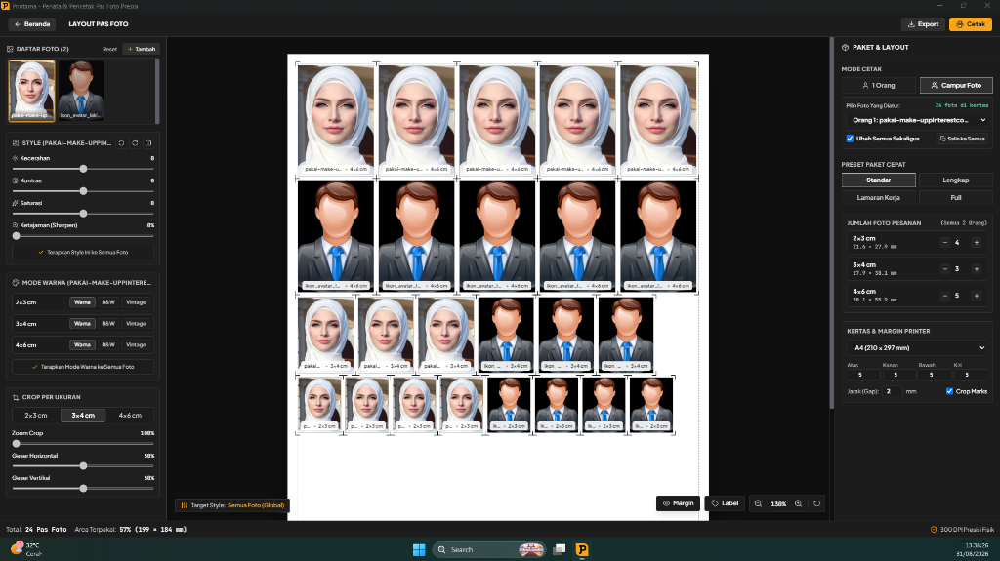
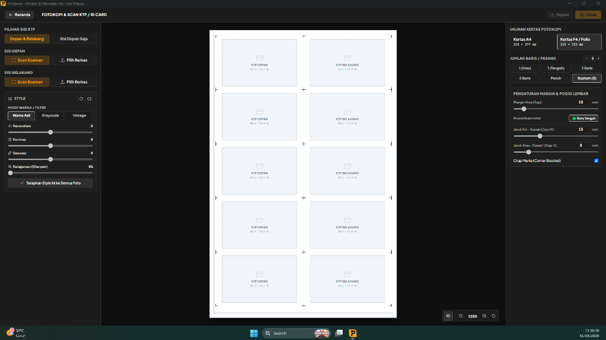
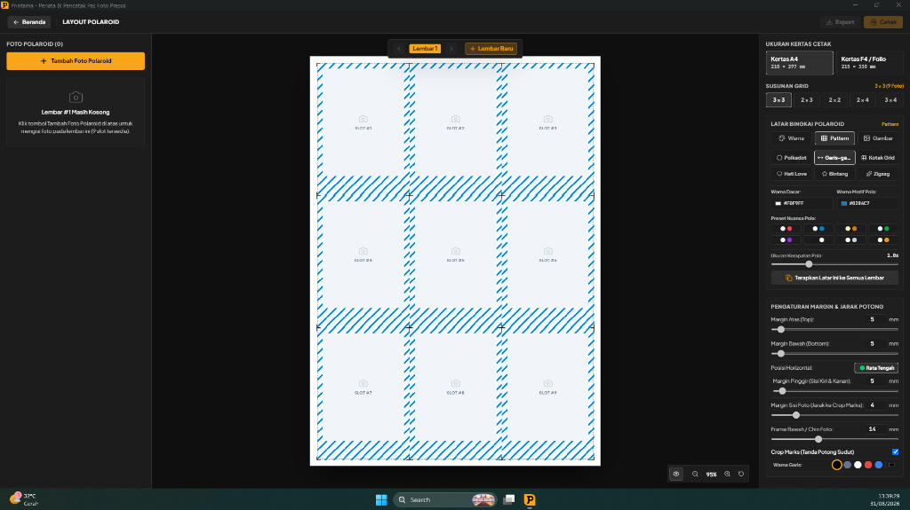
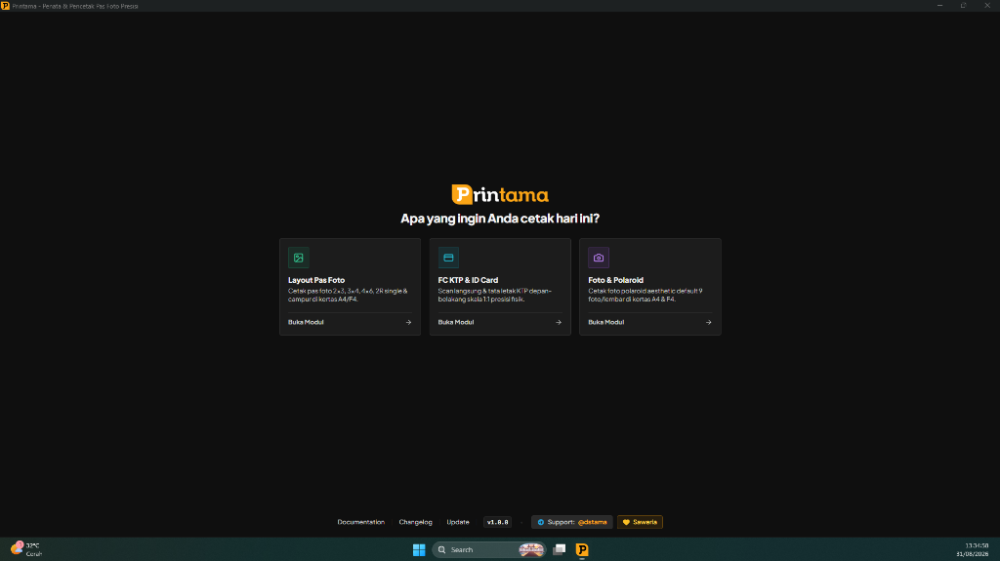

<p align="center">
  
</p>

<h1 align="center">Printama — Desktop App</h1>

<p align="center">
  <strong>Aplikasi Desktop Cerdas Penata &amp; Pencetak Pas Foto, Fotokopi KTP 1:1, dan Polaroid Studio Aesthetic di Kertas A4 &amp; F4 Presisi 100% Offline.</strong>
</p>

<p align="center">
  <a href="https://print.tama.my.id"></a>
  
  
  
  <a href="https://t.me/dstama"></a>
  <a href="https://saweria.co/adyatamatech"></a>
</p>

---

## 📥 Unduh Berkas Rilis Resmi (v1.0.0)

| Edisi | Tipe Berkas | Ukuran | Link Unduhan |
|---|---|---|---|
| **Windows 10 & 11 (64-bit)** | Installer (.exe) | ~90.8 MB | [Download Installer](https://github.com/adyatamamedia/printama/releases/download/v1.0.0/Printama-Setup-1.0.0.exe) |
| **Windows 10 & 11 (64-bit)** | Portable Standalone | ~90.6 MB | [Download Portable](https://github.com/adyatamamedia/printama/releases/download/v1.0.0/Printama-1.0.0-Portable.exe) |
| **Windows 7 & 8 Legacy (64-bit)** | Installer (.exe) | ~350 MB | [Download Win7 Installer](https://github.com/adyatamamedia/printama/releases/download/v1.0.0/Printama-Setup-1.0.0-Win7.exe) |
| **Windows 7 & 8 Legacy (64-bit)** | Portable Standalone | ~349 MB | [Download Win7 Portable](https://github.com/adyatamamedia/printama/releases/download/v1.0.0/Printama-1.0.0-Win7-Portable.exe) |

---

## 📖 Tentang Printama

**Printama** dirancang khusus untuk pemilik usaha percetakan, digital printing, studio foto, dan fotokopi agar dapat menata tata letak foto siap cetak dalam hitungan detik tanpa perlu melakukan kalkulasi manual yang memakan waktu di CorelDraw atau Photoshop.

Aplikasi berjalan **100% secara offline** di komputer lokal pengguna. Seluruh pemrosesan foto, cropping, penyesuaian warna, dan ekspor dokumen PDF 300 DPI dilakukan tanpa mengirimkan data ke internet sehingga **privasi foto pelanggan terjamin 100% aman**.

---

## 🌟 3 Modul Utama Cetak

### 1. 📷 Modul Layout Pas Foto Cerdas
- **Preset Paket Siap Cetak:**
  - **Standar (12 Foto):** 4 lembar 2×3, 3 lembar 3×4, 5 lembar 4×6.
  - **Lengkap (19 Foto):** 8 lembar 2×3, 6 lembar 3×4, 5 lembar 4×6.
  - **Lamaran Kerja (11 Foto):** 6 lembar 3×4, 5 lembar 4×6.
  - **Full (35 Foto):** 8 lembar 2×3, 12 lembar 3×4, 15 lembar 4×6.
- **Mode Cetak:** Mendukung mode 1 Orang maupun mode Campur (multi-orang/multi-foto).
- **Independen Cropping & Style:** Pengaturan crop terpisah per ukuran (2×3, 3×4, 4×6, 2R) serta isolasi filter warna per foto.

### 2. 🪪 Modul Fotokopi & Scan KTP / ID Card
- **Integrasi Hardware Scanner:** Fitur scan langsung dari perangkat scanner hardware melalui protokol WIA (Windows Image Acquisition).
- **Skala Fisik Presisi 1:1:** Dimensi kartu presisi sesuai ukuran standar identitas fisik (85.6 × 54 mm).
- **Format Tata Letak:** 1 Pasang (Atas/Tengah), 2 Baris (2 Pasang), 4 Baris (4 Pasang), atau Lembar Penuh.
- **Corner Crop Marks:** Panduan garis potong sudut rapi untuk mempermudah pemotongan fisik.

### 3. 🖼️ Modul Polaroid Studio Aesthetic
- **Auto-Pagination Multi-Lembar:** Pengisian otomatis multi-halaman. Jika mengimpor 13 foto pada mode 9 foto/lembar, sisa 4 foto otomatis dibuatkan di Lembar #2.
- **Pilihan Grid:** Susunan 3×3 (9 foto), 2×3 (6 foto), 2×2 (4 foto), 2×4 (8 foto), dan 3×4 (12 foto).
- **6 Motif Background:** Polkadot, Stripes, Grid, Love, Star, dan Zigzag, atau upload tekstur gambar sendiri.
- **Foto Caption:** Input teks caption pada bingkai bawah foto polaroid.

---

## 🛠️ Fitur Teknis & Keunggulan

- **Built-in Image Adjustments:** Kecerahan (*Brightness*), Kontras (*Contrast*), Saturasi (*Saturation*), Ketajaman (*Sharpening*), mode *Grayscale*, dan *Vintage Sepia* tanpa editor tambahan.
- **Kalibrasi Margin Printer:** Kompensasi margin fisik printer (Epson, Canon, HP, Brother) agar tepi foto tidak terpotong rol kertas.
- **Ekspor Dokumen 300 DPI Ultra-Crisp:** Ekspor langsung ke PDF Siap Cetak, PNG transparan, JPEG resolusi tinggi, atau print langsung ke printer aktif.
- **Kertas yang Didukung:** Kertas A4 (210 × 297 mm) dan Kertas F4 / Folio (215 × 330 mm).

---

## 📸 Tangkapan Layar Aplikasi

| Modul Pas Foto Campur | Modul FC KTP 1:1 |
|:---:|:---:|
|  |  |

| Modul Polaroid Studio | Home Dashboard |
|:---:|:---:|
|  |  |

---

## 💻 Tech Stack

- **Runtime & Desktop Framework:** [Electron](https://www.electronjs.org/) + [electron-vite](https://electron-vite.org/)
- **Frontend UI:** [React 18](https://react.dev/) + [TypeScript](https://www.typescriptlang.org/)
- **Styling:** [Tailwind CSS](https://tailwindcss.com/) + [Lucide Icons](https://lucide.dev/)
- **State Management:** [Zustand](https://github.com/pmndrs/zustand)
- **Image Processing & PDF Engine:** HTML5 Canvas 300 DPI / Sharp / PDF-Lib

---

## 🚀 Panduan Memulai di Lokal

### Prasyarat
- **Node.js** v18.x atau v20.x
- **NPM** atau **Yarn**
- Sistem Operasi **Windows 10 / Windows 11 (64-bit)**

### 1. Clone Repository
```bash
git clone https://github.com/adyatamamedia/printama.git
cd printama
```

### 2. Install Dependencies
```bash
npm install
```

### 3. Jalankan Mode Development
```bash
npm run dev
```

### 4. Build Paket Installer / Executable
```bash
npm run build
```
File installer `.exe` dan portable `.zip` akan dihasilkan di folder `dist/` atau `out/`.

---

## 🌐 Official Landing Page Website

Proyek ini telah dilengkapi dengan landing page resmi modern yang siap di-deploy ke domain `print.tama.my.id`:
- Direktori: `landing/`
- Berkas Utama:
  - `landing/index.html` — Halaman Beranda
  - `landing/docs.html` — Dokumentasi Lengkap & Panduan Pengguna
  - `landing/changelog.html` — Riwayat Rilis & Pembaruan
  - `landing/update.html` — Pusat Unduhan & Update

---

## 💬 Dukungan & Kontak Pengembang

Jika Anda memiliki pertanyaan, saran fitur, kendala instalasi, atau ingin berdiskusi mengenai pengembangan Printama:

- **Telegram Support:** [@dstama](https://t.me/dstama)
- **Website:** [print.tama.my.id](https://print.tama.my.id)

---

## ☕ Dukung Pengembangan (Donasi Saweria)

Aplikasi Printama dikembangkan secara independen untuk memajukan efisiensi industri percetakan. Jika aplikasi ini bermanfaat untuk usaha Anda, Anda dapat memberikan dukungan apresiasi dan donasi melalui:

👉 **[https://saweria.co/adyatamatech](https://saweria.co/adyatamatech)**

Setiap dukungan sangat berarti untuk keberlanjutan pemeliharaan dan penambahan fitur-fitur baru pada Printama.

---

## 📄 Lisensi & Hak Cipta

© 2026 **Printama**. Dikembangkan oleh **[@dstama](https://t.me/dstama)** — **AdyatamaTECH**.  
All rights reserved.
